# Workshop PoC

This is only a PoC that demonstrates how one might be able to launch a workshop using containers in a multi-tenant fashion.


## Architecture

The project uses a combination of containers to create an isolated workshop environment with a modern React frontend and Express backend API.

```mermaid
flowchart TD
    User[👤 User] -->|http://localhost:8080| Frontend
    User -->|http://localhost:8085| VSCode
    User -->|http://localhost:8001| Instructions

    subgraph "Web Application Layer"
        Frontend[🌐 React Frontend<br/>Vite + nginx<br/>:8080]
        Backend[⚡ Express Backend<br/>API Server<br/>:8000]
        Instructions[📚 Instructions<br/>Markdown Server<br/>:8001]
        
        Frontend -->|API calls| Backend
    end

    subgraph "Development Environment"
        VSCode[💻 VS Code Server<br/>coder/code-server<br/>:8085]
        project@{ shape: odd, label: "/home/coder/project" }
        socket@{ shape: odd, label: "/var/run/docker.sock" }
        
        subgraph "Port Forwarding"
            localhostPorts[Localhost ports<br/>:3001]
            socat[Socat processes]
            Forwarder[Host Port Forwarder]
        end
    end

    subgraph "Infrastructure Layer"
        Setup[🔧 Project Setup<br/>Initialization]
        ProxyContainer[🔒 Socket Proxy<br/>Security & Isolation]
        WorkspaceCleaner[🧹 Workspace Cleaner<br/>Resource Management]
    end

    subgraph "Storage"
        Volume@{ shape: cyl, label: "project\nvolume" }
        SocketVolume@{ shape: cyl, label: "socket-proxy\nvolume" }
    end

    %% Setup and Volume relationships
    Setup -->|Clones workshop repo| Volume
    Volume -->|Shared workspace| project
    Volume -->|Content source| Backend
    Volume -->|Docs content| Instructions

    %% Backend connections
    Backend -->|File operations| Volume
    Backend -->|Container management| socket
    Backend -->|Workspace interaction| VSCode

    %% VS Code and Port Forwarding
    VSCode -->|Shares network namespace| Forwarder
    Forwarder -->|Port discovery| socat
    socat <-->|localhost forwarding| localhostPorts

    %% Socket Proxy
    ProxyContainer -->|Secure Docker API| SocketVolume
    SocketVolume -->|Mounted proxy| socket
    SocketVolume -->|Security layer| Forwarder

    %% Workspace Management
    WorkspaceCleaner -->|Resource cleanup| SocketVolume

    %% Styling
    classDef webLayer fill:#e1f5fe,stroke:#01579b,stroke-width:2px
    classDef devLayer fill:#f3e5f5,stroke:#4a148c,stroke-width:2px
    classDef infraLayer fill:#e8f5e8,stroke:#1b5e20,stroke-width:2px
    classDef storage fill:#fff3e0,stroke:#e65100,stroke-width:2px

    class Frontend,Backend,Instructions webLayer
    class VSCode,project,socket,localhostPorts,socat,Forwarder devLayer
    class Setup,ProxyContainer,WorkspaceCleaner infraLayer
    class Volume,SocketVolume storage
```



### Component Overview

**Web Application Layer:**
- **React Frontend** (Port 8080) - Modern React application built with Vite, served by nginx. Provides the main user interface for the workshop.
- **Express Backend** (Port 8000) - RESTful API server that handles file operations, workspace management, and communication with the development environment.
- **Instructions Server** (Port 8001) - Legacy markdown rendering server for backward compatibility, renders workshop documentation.

**Development Environment:**
- **VS Code Server** (Port 8085) - Browser-based VS Code instance using [coder/code-server](https://github.com/coder/code-server) for live development.
- **Host Port Forwarder** - Runs in the same network namespace as VS Code, enabling localhost port forwarding for applications started within the IDE.

**Infrastructure Layer:**
- **Project Setup** - Initialization container that clones the workshop repository and sets up the workspace.
- **[Docker Socket Proxy](https://github.com/mikesir87/docker-socket-proxy)** - Security wrapper for the Docker Socket with protections and remapping:
  - Filters responses to only show workshop-created containers
  - Restricts mount sources to the project workspace
  - Remaps paths to use volumes instead of bind mounts
  - Ensures Testcontainers also uses the proxied socket
- **Workspace Cleaner** - Resource management service for cleanup and maintenance.

### Key Features

- **Modern Stack**: React frontend with Express backend API
- **Isolated Environment**: Docker socket proxying ensures security and isolation
- **Port Forwarding**: Localhost ports from VS Code are accessible to the frontend
- **Volume Remapping**: File paths are automatically remapped to secure volumes
- **Live Development**: Real-time interaction between web interface and VS Code workspace

## Known limitations

- Running multiple instances will cause port conflicts
- Volume names are currently hard-coded in the Compose file (for remapping/allowlisting of mount sources)

## Try it out

To try it out, you'll first start off by launching the workshop environment. After that, you can try a few things in the workshop environment.

### Start the workshop stack

1. Clone this project

2. Copy .env.example to .env

3. Start the stack using Docker Compose

    ```console
    docker compose up -d --build
    ```

4. Access the services:
   - **React Frontend**: http://localhost:8080 (Main workshop interface)
   - **VS Code Server**: http://localhost:8085 (Development environment - password: `password`)
   - **Instructions**: http://localhost:8001 (Legacy documentation)
   - **Backend API**: http://localhost:8000 (REST API endpoints)

### Test out the workshop environment

1. Open the React frontend at http://localhost:8080 to see the modern workshop interface

2. Open VS Code Server at http://localhost:8085 and enter the password `password`

3. In the VS Code terminal, run a `docker ps`. Notice how you see no other containers, even though there are other containers running on the machine (run the same `docker ps` in another terminal directly on your machine)!

4. Start the application stack by launching Docker Compose:

    ```console
    docker compose up -d
    ````

    You'll see all of the containers start up successfully!

5. Run another `docker ps` and you'll see the containers you started!

6. Try out Testcontainers by running the following command:

    ```console
    npm run integration-test
    ```

### Experiment - volume remapping

1. In the VS Code terminal, start another container and mount the `dev/db` directory into the container:

    ```console
    docker run --rm -tiv ./dev/db:/data --name=data-demo ubuntu
    ```

2. In that newly launched container, run `ls /data` and see the file that's there! 

    ```console
    root@a8f1776a6069:/# ls /data
    1-create-schema.sql
    ```

3. On your host machine, run the following command to look at the mount source:

    ```console
    docker inspect --format='{{range .Mounts}}{{println .Type .Name .Source .Destination}}{{end}}' data-demo
    ```

    What you'll see is this is _not_ a bind mount (as the `./dev/db` argument in the `docker run` command would suggest). Instead, it is a mount to the volume named `project`!

4. Exit the container now by running `exit` (in the VS Code terminal).

### Experiment - Docker Socket remapping

1. Start a new container and share the Docker socket:

    ```console
    docker run --rm -tiv /var/run/docker.sock:/var/run/docker.sock --name=socket-demo docker sh
    ```

2. In the new container, run `docker ps`. You should only see the containers created since you started the workshop environment!

3. Run the following command to inspect the container and see where the Docker Socket is coming from:

    ```console
    docker inspect --format='{{range .Mounts}}{{println .Type .Name .Source .Destination}}{{end}}' socket-demo
    ```

    In the output, you should see an entry for:

    ```
    volume socket-proxy /var/lib/docker/volumes/socket-proxy/_data /var/run/docker.sock
    ```

    The socket is coming from the Docker Socket proxy... meaning this nested container is _also_ being proxied!

### API Endpoints

The Express backend provides RESTful API endpoints for integration:

- `GET /api/health` - Health check endpoint
- `GET /api/files` - List workspace files
- `POST /api/files` - Create/update files
- `GET /api/workspace/status` - Get workspace status
- Additional endpoints for workshop-specific functionality
